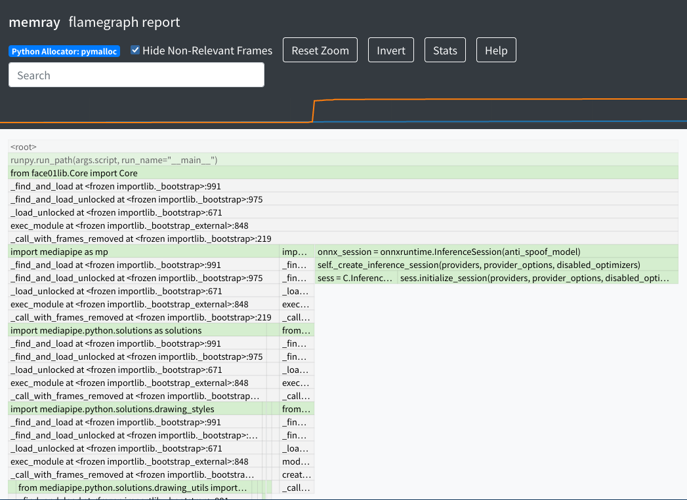

<!--  
- 最終更新日
- 
  -->

# Python: Memory leakポイントを探す

## mediapipe off
```bash

Predetermined number of frames: 50
Number of frames processed: 50
Total processing time: 19.383[seconds]
Per frame: 0.388[seconds]

 --------------------
#  1
stat: /home/terms/bin/FACE01/FACE01.py:373: size=4627 KiB (+4627 KiB), count=12 (+12), average=386 KiB
        File "/home/terms/bin/FACE01/FACE01.py", line 373
          common_main(exec_times)
        File "/home/terms/bin/FACE01/FACE01.py", line 293
          frame_datas_array = main_process().__next__()
        File "/home/terms/bin/FACE01/FACE01.py", line 236
          frame_datas_array = Core_obj.frame_post_processing(logger, args_dict, face_encodings, frame_datas_array, GLOBAL_MEMORY)
        File "/home/terms/bin/FACE01/face01lib/Core.py", line 836
          resized_frame = self.draw_text_for_name(self.logger, left,right,bottom,name, p,self.args_dict["tolerance"],pil_img_obj)
        File "/home/terms/bin/FACE01/face01lib/Core.py", line 1270
          resized_frame = self.convert_pil_img_to_ndarray(self.pil_img_obj)
        File "/home/terms/bin/FACE01/face01lib/Core.py", line 1214
          frame = np.array(self.pil_img_obj)

 --------------------
#  2
stat: /home/terms/bin/FACE01/FACE01.py:373: size=2998 KiB (+2998 KiB), count=22134 (+22134), average=139 B
        File "/home/terms/bin/FACE01/FACE01.py", line 373
          common_main(exec_times)
        File "/home/terms/bin/FACE01/FACE01.py", line 304
          event, _ = window.read(timeout = 1)
        File "/home/terms/bin/FACE01/lib/python3.8/site-packages/PySimpleGUI/PySimpleGUI.py", line 10057
          _refresh_debugger()
        File "/home/terms/bin/FACE01/lib/python3.8/site-packages/PySimpleGUI/PySimpleGUI.py", line 22930
          frame, *others = inspect.stack()[1]
        File "/usr/lib/python3.8/inspect.py", line 1526
          return getouterframes(sys._getframe(1), context)
        File "/usr/lib/python3.8/inspect.py", line 1503
          frameinfo = (frame,) + getframeinfo(frame, context)
        File "/usr/lib/python3.8/inspect.py", line 1477
          lines, lnum = findsource(frame)
        File "/usr/lib/python3.8/inspect.py", line 794
          lines = linecache.getlines(file, module.__dict__)
        File "/usr/lib/python3.8/linecache.py", line 47
          return updatecache(filename, module_globals)
        File "/usr/lib/python3.8/linecache.py", line 137
          lines = fp.readlines()

 --------------------
#  3
stat: /home/terms/bin/FACE01/FACE01.py:373: size=2775 KiB (+2775 KiB), count=6 (+6), average=463 KiB
        File "/home/terms/bin/FACE01/FACE01.py", line 373
          common_main(exec_times)
        File "/home/terms/bin/FACE01/FACE01.py", line 293
          frame_datas_array = main_process().__next__()
        File "/home/terms/bin/FACE01/FACE01.py", line 225
          frame_datas_array = Core_obj.frame_pre_processing(logger, args_dict, frame_generator_obj.__next__())
        File "/home/terms/bin/FACE01/face01lib/Core.py", line 447
          overlay: cv2.Mat = self.resized_frame.copy()

 --------------------
#  4
stat: /home/terms/bin/FACE01/FACE01.py:373: size=2700 KiB (+2700 KiB), count=2 (+2), average=1350 KiB
        File "/home/terms/bin/FACE01/FACE01.py", line 373
          common_main(exec_times)
        File "/home/terms/bin/FACE01/FACE01.py", line 293
          frame_datas_array = main_process().__next__()
        File "/home/terms/bin/FACE01/FACE01.py", line 225
          frame_datas_array = Core_obj.frame_pre_processing(logger, args_dict, frame_generator_obj.__next__())
        File "/home/terms/bin/FACE01/face01lib/video_capture.py", line 346
          ret, frame = vcap.read()

 --------------------
#  5
stat: /home/terms/bin/FACE01/FACE01.py:107: size=1614 KiB (+1614 KiB), count=3 (+3), average=538 KiB
        File "/home/terms/bin/FACE01/FACE01.py", line 107
          args_dict =  Initialize().initialize(conf_dict)
        File "/home/terms/bin/FACE01/face01lib/Initialize.py", line 32
          LoadImage_obj.LI(set_height, set_width)
        File "/home/terms/bin/FACE01/face01lib/LoadImage.py", line 35
          telop_image = cv2.imread("images/telop.png", cv2.IMREAD_UNCHANGED)
====================


⭐️⭐️⭐️ Used Memory: 1.7 GiB
                       types |   # objects |   total size
============================ | =========== | ============
                       tuple |       70854 |     18.43 MB
               numpy.ndarray |         923 |     15.37 MB
                         str |       99012 |     14.23 MB
                        dict |       18278 |      7.43 MB
                        code |       19657 |      3.34 MB
   tracemalloc.StatisticDiff |       47360 |      3.25 MB
                        type |        3264 |      2.98 MB
       tracemalloc.Traceback |       47360 |      1.81 MB
                        list |        6633 |      1.44 MB
                         set |        1333 |    811.68 KB
                       bytes |         189 |    720.31 KB
  builtin_function_or_method |        7675 |    539.65 KB
                     weakref |        7014 |    493.17 KB
                         int |       17689 |    485.78 KB
     collections.OrderedDict |         224 |    401.42 KB
```


## mediapipe on
```bash
====================
memory_leak.pyが呼び出されました
====================
[2022-08-26 19:21:25,256] [face01lib/load_priset_image] [load_priset_image.py] [INFO] npKnown.npz を読み込みます
INFO: Created TensorFlow Lite XNNPACK delegate for CPU.
Predetermined number of frames: 50
Number of frames processed: 50
Total processing time: 18.335[seconds]
Per frame: 0.367[seconds]

 --------------------
#  1
stat: /home/terms/bin/FACE01/FACE01.py:373: size=4627 KiB (+4627 KiB), count=12 (+12), average=386 KiB
        File "/home/terms/bin/FACE01/FACE01.py", line 373
          common_main(exec_times)
        File "/home/terms/bin/FACE01/FACE01.py", line 293
          frame_datas_array = main_process().__next__()
        File "/home/terms/bin/FACE01/FACE01.py", line 236
          frame_datas_array = Core_obj.frame_post_processing(logger, args_dict, face_encodings, frame_datas_array, GLOBAL_MEMORY)
        File "/home/terms/bin/FACE01/face01lib/Core.py", line 836
          resized_frame = self.draw_text_for_name(self.logger, left,right,bottom,name, p,self.args_dict["tolerance"],pil_img_obj)
        File "/home/terms/bin/FACE01/face01lib/Core.py", line 1270
          resized_frame = self.convert_pil_img_to_ndarray(self.pil_img_obj)
        File "/home/terms/bin/FACE01/face01lib/Core.py", line 1214
          frame = np.array(self.pil_img_obj)

 --------------------
#  2
stat: /home/terms/bin/FACE01/FACE01.py:373: size=2998 KiB (+2998 KiB), count=22134 (+22134), average=139 B
        File "/home/terms/bin/FACE01/FACE01.py", line 373
          common_main(exec_times)
        File "/home/terms/bin/FACE01/FACE01.py", line 304
          event, _ = window.read(timeout = 1)
        File "/home/terms/bin/FACE01/lib/python3.8/site-packages/PySimpleGUI/PySimpleGUI.py", line 10057
          _refresh_debugger()
        File "/home/terms/bin/FACE01/lib/python3.8/site-packages/PySimpleGUI/PySimpleGUI.py", line 22930
          frame, *others = inspect.stack()[1]
        File "/usr/lib/python3.8/inspect.py", line 1526
          return getouterframes(sys._getframe(1), context)
        File "/usr/lib/python3.8/inspect.py", line 1503
          frameinfo = (frame,) + getframeinfo(frame, context)
        File "/usr/lib/python3.8/inspect.py", line 1477
          lines, lnum = findsource(frame)
        File "/usr/lib/python3.8/inspect.py", line 794
          lines = linecache.getlines(file, module.__dict__)
        File "/usr/lib/python3.8/linecache.py", line 47
          return updatecache(filename, module_globals)
        File "/usr/lib/python3.8/linecache.py", line 137
          lines = fp.readlines()

 --------------------
#  3
stat: /home/terms/bin/FACE01/FACE01.py:373: size=2775 KiB (+2775 KiB), count=6 (+6), average=463 KiB
        File "/home/terms/bin/FACE01/FACE01.py", line 373
          common_main(exec_times)
        File "/home/terms/bin/FACE01/FACE01.py", line 293
          frame_datas_array = main_process().__next__()
        File "/home/terms/bin/FACE01/FACE01.py", line 225
          frame_datas_array = Core_obj.frame_pre_processing(logger, args_dict, frame_generator_obj.__next__())
        File "/home/terms/bin/FACE01/face01lib/Core.py", line 447
          overlay: cv2.Mat = self.resized_frame.copy()

 --------------------
#  4
stat: /home/terms/bin/FACE01/FACE01.py:373: size=2700 KiB (+2700 KiB), count=2 (+2), average=1350 KiB
        File "/home/terms/bin/FACE01/FACE01.py", line 373
          common_main(exec_times)
        File "/home/terms/bin/FACE01/FACE01.py", line 293
          frame_datas_array = main_process().__next__()
        File "/home/terms/bin/FACE01/FACE01.py", line 225
          frame_datas_array = Core_obj.frame_pre_processing(logger, args_dict, frame_generator_obj.__next__())
        File "/home/terms/bin/FACE01/face01lib/video_capture.py", line 346
          ret, frame = vcap.read()

 --------------------
#  5
stat: /home/terms/bin/FACE01/FACE01.py:107: size=1614 KiB (+1614 KiB), count=3 (+3), average=538 KiB
        File "/home/terms/bin/FACE01/FACE01.py", line 107
          args_dict =  Initialize().initialize(conf_dict)
        File "/home/terms/bin/FACE01/face01lib/Initialize.py", line 32
          LoadImage_obj.LI(set_height, set_width)
        File "/home/terms/bin/FACE01/face01lib/LoadImage.py", line 35
          telop_image = cv2.imread("images/telop.png", cv2.IMREAD_UNCHANGED)
====================


⭐️⭐️⭐️ Used Memory: 2.5 GiB
                       types |   # objects |   total size
============================ | =========== | ============
                       tuple |       70919 |     18.43 MB
               numpy.ndarray |         923 |     15.40 MB
                         str |       99018 |     14.23 MB
                        dict |       18627 |      7.49 MB
                        code |       19658 |      3.34 MB
   tracemalloc.StatisticDiff |       47377 |      3.25 MB
                        type |        3264 |      2.98 MB
       tracemalloc.Traceback |       47377 |      1.81 MB
                        list |        6633 |      1.44 MB
                         set |        1333 |    811.18 KB
                       bytes |         189 |    720.00 KB
  builtin_function_or_method |        7673 |    539.51 KB
                     weakref |        7013 |    493.10 KB
                         int |       17770 |    488.00 KB
     collections.OrderedDict |         224 |    401.42 KB
 ```

# memray
```bash
 terms  terms-Desks  ~/bin/FACE01  python -m memray run -o output.bin FACE01.py 
  terms  terms-Desks  ~/bin/FACE01  python -m memray flamegraph output.bin
 ```


```bash
exec_times: 1
Filename: /home/terms/bin/FACE01/face01lib/Core.py

Line #    Mem usage    Increment  Occurrences   Line Contents
=============================================================
    88   2833.8 MiB   2833.8 MiB           1       @profile()
    89                                             def mp_face_detection_func(self, resized_frame, model_selection=0, min_detection_confidence=0.4):
    90   2833.8 MiB      0.0 MiB           2           face = mp.solutions.face_detection.FaceDetection(  # type: ignore
    91   2833.8 MiB      0.0 MiB           1               model_selection=model_selection,
    92   2833.8 MiB      0.0 MiB           1               min_detection_confidence=min_detection_confidence
    93                                                 )
    94                                                 """refer to
    95                                                 https://solutions.mediapipe.dev/face_detection#python-solution-api
    96                                                 """    
    97                                                 # 推論処理
    98   2849.0 MiB     15.2 MiB           1           inference = face.process(resized_frame)
    99                                                 """
   100                                                 Processes an RGB image and returns a list of the detected face location data.
   101                                                 Args:
   102                                                     image: An RGB image represented as a numpy ndarray.
   103                                                 Raises:
   104                                                     RuntimeError: If the underlying graph throws any error.
   105                                                 ValueError: 
   106                                                     If the input image is not three channel RGB.
   107                                                 Returns:
   108                                                     A NamedTuple object with a "detections" field that contains a list of the
   109                                                     detected face location data.'
   110                                                 """
   111   2849.0 MiB      0.0 MiB           1           return inference
```


```bash
Filename: /home/terms/bin/FACE01/face01lib/Core.py

Line #    Mem usage    Increment  Occurrences   Line Contents
=============================================================
   113   2341.1 MiB   2341.1 MiB           1       @profile()
   114                                             def return_face_location_list(
   115                                                 self,
   116                                                 resized_frame,
   117                                                 set_width,
   118                                                 set_height,
   119                                                 model_selection,
   120                                                 min_detection_confidence
   121                                             ) -> list:
   122                                                 """
   123                                                 return: face_location_list
   124                                                 """
   125   2341.1 MiB      0.0 MiB           1           self.resized_frame: np.ndarray = resized_frame
   126   2341.1 MiB      0.0 MiB           1           self.set_width: int = set_width
   127   2341.1 MiB      0.0 MiB           1           self.set_height: int = set_height
   128   2341.1 MiB      0.0 MiB           1           self.model_selection = model_selection
   129   2341.1 MiB      0.0 MiB           1           self.min_detection_confidence = min_detection_confidence
   130   2341.1 MiB      0.0 MiB           1           self.resized_frame.flags.writeable = False
   131   2341.1 MiB      0.0 MiB           1           face_location_list: list = []
   132                                                 # person_frame = np.empty((2,0), dtype = np.float64)
   133                                                 # date = datetime.now().strftime("%Y,%m,%d,%H,%M,%S,%f")
   134                                         
   135   2357.6 MiB     16.5 MiB           2           result = self.mp_face_detection_func(
   136   2341.1 MiB      0.0 MiB           1               self.resized_frame,
   137   2341.1 MiB      0.0 MiB           1               self.model_selection,
   138   2341.1 MiB      0.0 MiB           1               self.min_detection_confidence
   139                                                 )
   140   2357.6 MiB      0.0 MiB           1           if not result.detections:
   141                                                     return face_location_list
   142                                                 else:
   143   2357.6 MiB      0.0 MiB           4               for detection in result.detections:
   144   2357.6 MiB      0.0 MiB           3                   xleft:int = int(detection.location_data.relative_bounding_box.xmin * self.set_width)
   145   2357.6 MiB      0.0 MiB           3                   xtop :int= int(detection.location_data.relative_bounding_box.ymin * self.set_height)
   146   2357.6 MiB      0.0 MiB           3                   xright:int = int(detection.location_data.relative_bounding_box.width * self.set_width + xleft)
   147   2357.6 MiB      0.0 MiB           3                   xbottom:int = int(detection.location_data.relative_bounding_box.height * self.set_height + xtop)
   148                                                         # see bellow
   149                                                         # https://stackoverflow.com/questions/71094744/how-to-crop-face-detected-via-mediapipe-in-python
   150                                                         
   151   2357.6 MiB      0.0 MiB           3                   if xleft <= 0 or xtop <= 0:  # xleft or xtop がマイナスになる場合があるとバグる
   152                                                             continue
   153   2357.6 MiB      0.0 MiB           3                   face_location_list.append((xtop,xright,xbottom,xleft))  # Dlib_api() order
   154                                                 
   155                                                 """DEBUG Memory leak"""
   156   2357.6 MiB      0.0 MiB           1           del result
   157                                                 
   158   2357.6 MiB      0.0 MiB           1           self.resized_frame.flags.writeable = True
   159   2357.6 MiB      0.0 MiB           1           return face_location_list
```