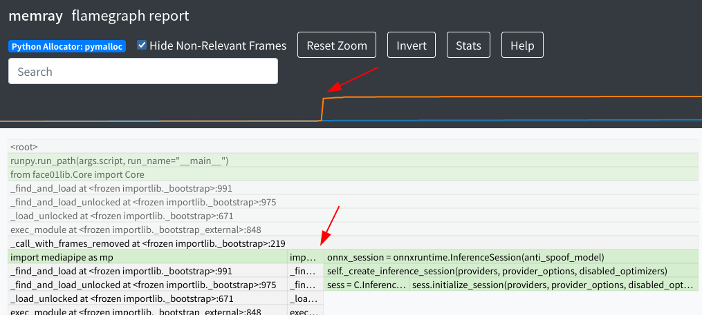

# Python：メモリーリークの探し方3選
探すのが難しいと言われるメモリーリーク。先日[あるプロジェクト](https://github.com/yKesamaru/FACE01_SAMPLE)のメモリーリークをFixしましたのでその時に使用した3つの方法をご紹介します。

# 1. Memory_leak
まず拙作の`Memory_leak`からご紹介します。
https://github.com/yKesamaru/Memory_leak
> Output the result of the tracemalloc module with formatted.
## 使用例
### 書き方
```python
from memory_leak import Memory_leak
m = Memory_leak(limit=2, key_type='lineno')
m.memory_leak_analyze_start()

# ...Your application code

m.memory_leak_analyze_stop()
```
これだけです。
### 出力例
```bash
------------------------------
Called 'memory_leak.py' with 'lineno' mode...
------------------------------

# ...

Top 2 lines
#1: File:~/bin/FACE01/face01lib/Core.py
    Line: 1253
    Size: 3.5 MiB
    frame = np.array(self.pil_img_obj)
-----
#2: File:/usr/lib/python3.8/linecache.py
    Line: 137
    Size: 3.5 MiB
    lines = fp.readlines()
-----
20483, Other: 29.4 MiB
Total allocated size: 36.4 MiB
------------------------------
Used Memory: 1.5 GiB
------------------------------

Pympler report
                       types |   # objects |   total size
============================ | =========== | ============
                       tuple |      384549 |     23.37 MB
               numpy.ndarray |         922 |     14.04 MB
                         str |       67733 |     10.87 MB
                        dict |       21341 |      8.73 MB
                        code |       22285 |      3.79 MB
                        list |        7797 |      3.66 MB
                        type |        3793 |      3.52 MB
                         set |        1645 |    896.99 KB
                       bytes |         190 |    717.59 KB
  builtin_function_or_method |        7838 |    551.11 KB
                     weakref |        7686 |    540.42 KB
     collections.OrderedDict |         224 |    401.42 KB
                 abc.ABCMeta |         263 |    307.12 KB
           inspect.Parameter |        4336 |    271.00 KB
           method_descriptor |        3785 |    266.13 KB
```

### 引数
```python
- limit:(int)
  - Limit output lines.
- key_type:(str)
  - Select 'lineno' or 'traceback' output. Defaults to 'lineno'.
- nframe:(int, optional)
  - This can be specified only when key_type is 'traceback'. Defaults to 5.
```
例えば
```python
m = Memory_leak(limit=10, key_type='traceback,', nframe=20)
```
と引数を渡すと以下のような出力が出ます。（長いので途中省略）
```bash
Top 2 traceback
#1
/usr/lib/python3.8/runpy.py:194: size=3701 KiB (+3701 KiB), count=10 (+10), average=370 KiB
      File "/usr/lib/python3.8/runpy.py", line 194
        return _run_code(code, main_globals, None,
      File "/usr/lib/python3.8/runpy.py", line 87
        exec(code, run_globals)
      File "/home/terms/.vscode/extensions/ms-python.python-2022.12.1/pythonFiles/lib/python/debugpy/adapter/../../debugpy/launcher/../../debugpy/__main__.py", line 39
        cli.main()
      File "/home/terms/.vscode/extensions/ms-python.python-2022.12.1/pythonFiles/lib/python/debugpy/adapter/../../debugpy/launcher/../../debugpy/../debugpy/server/cli.py", line 430
        run()
      File "/home/terms/.vscode/extensions/ms-python.python-2022.12.1/pythonFiles/lib/python/debugpy/adapter/../../debugpy/launcher/../../debugpy/../debugpy/server/cli.py", line 284
        runpy.run_path(target, run_name="__main__")
      File "/home/terms/.vscode/extensions/ms-python.python-2022.12.1/pythonFiles/lib/python/debugpy/_vendored/pydevd/_pydevd_bundle/pydevd_runpy.py", line 321
        return _run_module_code(code, init_globals, run_name,
      File "/home/terms/.vscode/extensions/ms-python.python-2022.12.1/pythonFiles/lib/python/debugpy/_vendored/pydevd/_pydevd_bundle/pydevd_runpy.py", line 135
        _run_code(code, mod_globals, init_globals,
      File "/home/terms/.vscode/extensions/ms-python.python-2022.12.1/pythonFiles/lib/python/debugpy/_vendored/pydevd/_pydevd_bundle/pydevd_runpy.py", line 124
        exec(code, run_globals)
      File "/home/terms/bin/FACE01/CALL_FACE01.py", line 154
        pr.run('common_main(exec_times)', 'restats')
      File "/usr/lib/python3.8/cProfile.py", line 16
        return _pyprofile._Utils(Profile).run(statement, filename, sort)
      File "/usr/lib/python3.8/profile.py", line 53
        prof.run(statement)
      File "/usr/lib/python3.8/cProfile.py", line 95
        return self.runctx(cmd, dict, dict)
      File "/usr/lib/python3.8/cProfile.py", line 100
        exec(cmd, globals, locals)
      File "<string>", line 1
      File "/home/terms/bin/FACE01/CALL_FACE01.py", line 67
        frame_datas_array = fg.main_process().__next__()
      File "/home/terms/bin/FACE01/FACE01.py", line 237
        frame_datas_array = Core_obj.frame_post_processing(logger, args_dict, face_encodings, frame_datas_array, GLOBAL_MEMORY)
      File "/home/terms/bin/FACE01/face01lib/Core.py", line 875
        resized_frame = self.draw_text_for_name(self.logger, left,right,bottom,name, p,self.args_dict["tolerance"],pil_img_obj)
      File "/home/terms/bin/FACE01/face01lib/Core.py", line 1309
        resized_frame = self.convert_pil_img_to_ndarray(self.pil_img_obj)
      File "/home/terms/bin/FACE01/face01lib/Core.py", line 1253
        frame = np.array(self.pil_img_obj)
-----
#2
```
Python標準ライブラリである`tracemalloc`を見やすくフォーマットして出力してくれます。また人気のライブラリである`Pympler`を使ったサマリーも付属しています。どこでメモリーリークしているか全く予想がつかない状態の初期段階で活躍してくれるでしょう。

# 2. memory_profiler
ある程度絞れた段階でクラス内のメソッドなどに`@profile()`デコレータをつけることによって使用しているメモリを表示することが出来ます。おなじみの方法ですね。
https://pypi.org/project/memory-profiler/
## 使用例
### 書き方
```python
@profile()
def r_face_image(self, frame, face_location):
    self.frame = frame
    self.face_location = face_location
    face_image = Return_face_image().return_face_image(self.frame, self.face_location)
    return face_image
```
### 出力例
```bash
Line #    Mem usage    Increment  Occurrences   Line Contents
=============================================================
   952   1991.8 MiB   1991.8 MiB           1       @profile()
   953                                             def r_face_image(self, frame, face_location):
   954   1991.8 MiB      0.0 MiB           1           self.frame = frame
   955   1991.8 MiB      0.0 MiB           1           self.face_location = face_location
   956   1991.8 MiB      0.0 MiB           1           face_image = Return_face_image().return_face_image(self.frame, self.face_location)
   957   1991.8 MiB      0.0 MiB           1           return face_image
```

# 3. Memray
ビジュアルで分かりやすいライブラリです。
https://pypi.org/project/memray/
## 使用例
### 書き方
```bash
$ python3 -m memray run -o output.bin my_script.py
$ python3 -m memray flamegraph output.bin
```
### 出力例
赤の矢印のところがピンポイントで怪しいことがわかります。


公式ドキュメントには下図のようなライブモードも紹介されています。


# まとめ
Pythonのメモリー周りはなかなか奥深いですね。
最後に紹介した`Memray`はこれからどんどん大きくなりそうで興味深いです。
それでは。